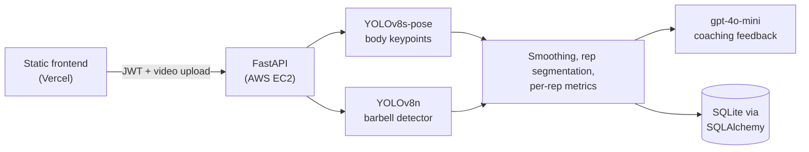

# Squat Optimizer

[](https://github.com/ktran113/squat_optimizer/actions/workflows/ci.yml)

Upload a phone video of a barbell squat and get back a rep count, a depth grade and knee angle for every rep, bar path deviation, tempo, and coaching feedback. Results are saved to your account so you can track sessions over time.

**Live demo:** [squat-optimizer-frontend.vercel.app](https://squat-optimizer-frontend.vercel.app/)


## Architecture



**Backend:** Python, FastAPI, SQLAlchemy, JWT auth with bcrypt password hashing
**Computer vision:** Ultralytics YOLOv8, OpenCV, NumPy, SciPy
**Frontend:** HTML, CSS, and vanilla JavaScript with canvas charts
**Infrastructure:** Docker, GitHub Actions, AWS EC2, Vercel

## How a video is analyzed

1. **Frame rate** is read from the video file, so tempo is correct for 30, 60, or 120 fps recordings.
2. **Pose estimation.** YOLOv8s-pose runs on every 2nd frame and keeps the most confident person. Keypoints for skipped frames are interpolated.
3. **Barbell detection.** A fine-tuned YOLOv8n detector runs on every 3rd frame, with interpolation in between.
4. **Smoothing.** Keypoints below 0.5 confidence are filled by interpolation, then a Savitzky-Golay filter (0.3 s window, scaled to the frame rate) removes jitter.
5. **Side selection.** The leg with the higher average confidence is used, since the far leg is usually hidden in a side view.
6. **Rep detection.** The vertical gap between knee and hip shrinks as the lifter descends. Rep bottoms are found as peaks in that signal that are at least 2 s apart and stand out by at least 80 px.
7. **Per-rep metrics.**
   - Depth: knee angle at the bottom. Under 90° is *below parallel*, under 100° is *parallel*, anything else is *partial*.
   - Bar path deviation: standard deviation of the bar's horizontal position within 0.5 s of the bottom.
   - Tempo: time between consecutive rep bottoms.
   - Hip-heel alignment: whether the hip stays within 50 px horizontally of the ankle.
8. **Feedback.** The metrics are sent to gpt-4o-mini for coaching cues. If the call fails (rate limit, network error, no API key), the analysis is still returned with a fallback message.
9. **Storage.** The session and one row per rep are written in a single transaction.

## Barbell detector

YOLOv8n fine-tuned for 10 epochs on 8,478 labeled images from a Roboflow dataset. On the 123-image validation split:

| Precision | Recall | mAP50 | mAP50-95 |
|---|---|---|---|
| 0.984 | 0.983 | 0.994 | 0.624 |

The weights are committed at `backend/data/models/barbell/weights/best.pt`. `backend/data/src/download_weights.py` downloads the dataset and retrains from scratch.

## Design decisions

**Savitzky-Golay instead of a moving average.** A moving average flattens peaks, and rep detection depends on peak height. Savitzky-Golay fits a small polynomial in each window, which removes jitter while keeping the bottom of each rep at its true depth.

**Prominence-based peak detection.** The first version counted 11 reps in a 2-rep video because small wobbles at the top and bottom of each rep registered as peaks. Requiring each peak to stand out from its surroundings by a minimum prominence removed the false positives. Both ends of the signal are padded so a rep cut off by the start or end of the video is still judged on the side that is visible.

**Frame skipping with interpolation.** Pose and bar position change little between adjacent frames, so the pose model runs on every 2nd frame and the barbell detector on every 3rd, with positions for skipped frames interpolated. That is 2x and 3x fewer model calls per video.

**Local weights instead of a hosted API.** Barbell detection originally called Roboflow's hosted inference API for every frame. Running the detector locally removed a network dependency and per-request latency from the analysis path.

**NaN-safe responses.** Frames where the bar is not detected are NaN internally. They are returned as `null`, since NaN is not valid JSON, and the frontend draws them as gaps in the bar path chart.

## API

All endpoints except `/`, `/register`, and `/login` require an `Authorization: Bearer <token>` header. Users can only read their own data; other users' profiles and sessions return 403.

| Method | Endpoint | Description |
|---|---|---|
| `POST` | `/register` | Create an account, returns a JWT |
| `POST` | `/login` | Log in, returns a JWT (valid 30 days) |
| `POST` | `/analyze-video` | Upload `.mp4`, `.mov`, `.avi`, or `.mkv`; returns metrics and feedback. Optional `fps` query parameter overrides the file's frame rate |
| `GET` | `/users/{id}` | User profile |
| `GET` | `/users/{id}/sessions` | Workout history, newest first (`limit`, `offset`) |
| `GET` | `/sessions/{id}` | One session with per-rep metrics |
| `GET` | `/` | Health check |

Interactive docs are served at `/docs` when the server is running.

## Running locally

Requires Python 3.13.

```bash
python -m venv .venv
source .venv/bin/activate
pip install -r requirements.txt
```

Create a `.env` file in the repo root:

| Variable | Required | Purpose |
|---|---|---|
| `JWT_SECRET_KEY` | Yes | Signs login tokens |
| `OPENAI_API_KEY` | No | Coaching feedback; a fallback message is returned without it |
| `DATABASE_URL` | No | Defaults to `sqlite:///./squat_optimizer.db` |
| `ROBOFLOW_API_KEY`, `ROBOFLOW_WORKSPACE`, `ROBOFLOW_PROJECT`, `ROBOFLOW_VERSION` | No | Only for retraining the barbell detector |

Start the API:

```bash
cd backend/data/src
uvicorn main:app --reload
```

The quickest way to try it is the interactive docs at http://localhost:8000/docs. To run the frontend against a local server, change `API_URL` at the top of each file in `frontend/js/` to `http://localhost:8000`, add your local frontend's origin to `allow_origins` in `main.py`, and serve the folder with `python -m http.server 5500 -d frontend`.

### With Docker

```bash
docker build -t squat-optimizer .
docker run -p 8000:8000 --env-file .env -v squat-data:/app/data squat-optimizer
```

The image uses CPU-only PyTorch and includes both model weights. The `squat-data` volume keeps the SQLite database across container restarts; leave `DATABASE_URL` out of `.env` so the container uses that volume.

## Tests

```bash
pip install -r requirements-dev.txt
pytest
```

The suite runs in a few seconds without a GPU or video files. Rep counting, depth grading, and smoothing are tested on generated keypoints with known rep bottoms and knee angles. API tests use a temporary SQLite database and replace the YOLO models with the same generated keypoints, covering registration, login, token validation, cross-user access, upload validation, and a full analysis request.

GitHub Actions runs the tests on every push and pull request, then builds the Docker image and checks that the container starts and responds.

## Evaluation and debugging tools

| Tool | What it does |
|---|---|
| `eval/run_eval.py` | Scores the pipeline against hand-labeled videos in `eval/labels.csv`: rep count accuracy, mean absolute error, a depth confusion matrix, and results by distance, camera angle, and lighting. Model outputs are cached per video, so re-scoring after a threshold change takes seconds. |
| `eval/import_repcount.py` | Converts annotations from the [RepCount](https://svip-lab.github.io/dataset/RepCount_dataset.html) dataset into `labels.csv` format. |
| `scripts/diagnose_reps.py` | Lists every candidate rep bottom in a video with its prominence and spacing, and which threshold rejected it. |
| `scripts/render_overlay.py` | Draws the pose skeleton, bar path, and per-rep metrics over a video as a GIF or MP4. |
| `benchmark.py` | Measures response times of the non-video endpoints. |

`eval/labels.csv` currently contains an example row. Add videos to `eval/videos/` and label them to produce results.

## Limitations

- **Side view only.** Knee angles are unreliable from the front or at an angle. `eval/view_check.py` can detect off-axis videos, but the API does not reject them yet.
- **Pixel-based thresholds.** Rep prominence, hip-heel alignment, and bar deviation are measured in pixels, so results shift with camera distance and resolution.
- **Synchronous analysis.** `/analyze-video` processes the video inside the request (10–30 s) and blocks the server from handling other requests meanwhile.
- **Extra rep at the end of shaky videos.** A shaky video that ends partway into a descent can be counted as one extra rep. A failing test (`xfail`) in `tests/test_squat_metrics.py` tracks it.

## Project structure

```
backend/data/
├── src/
│   ├── main.py               # FastAPI app and endpoints
│   ├── auth.py               # Password hashing and JWT
│   ├── models.py             # SQLAlchemy models
│   ├── database.py           # Engine and session setup
│   ├── detect_pose.py        # YOLOv8 pose estimation
│   ├── barbell_detection.py  # YOLOv8 barbell detection
│   ├── smooth.py             # Savitzky-Golay smoothing
│   ├── squat_metrics.py      # Rep detection and per-rep metrics
│   ├── feedback.py           # LLM coaching feedback
│   └── download_weights.py   # Retrain the barbell detector
└── models/                   # Model weights and training config
db/                           # PostgreSQL schema
eval/                         # Evaluation harness
scripts/                      # Debugging and demo tools
tests/                        # pytest suite
frontend/                     # Static site deployed to Vercel
.github/workflows/ci.yml      # Tests and Docker build
Dockerfile
```
